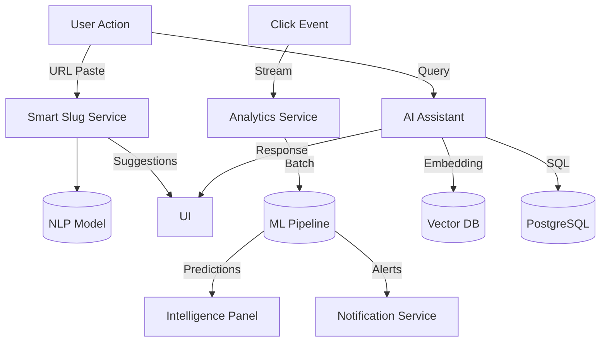

# AI — Nexus Links

> Artificial intelligence vision, features, and architecture.

## Vision

AI at Nexus Links is not a chatbot bolted onto the side. It's infrastructure intelligence — invisible predictions, recommendations, and automations embedded into every surface of the product.

Three principles guide our AI work:

1. **Augment, don't replace.** AI helps link managers work faster and smarter — it doesn't replace their judgment.
2. **Predictive, not reactive.** The best insight is the one you see before you ask for it.
3. **Privacy-first.** We train models on aggregate data only. Individual click data never leaves the workspace.

## Feature Roadmap

### Phase 1: Smart Slugs (Q1 2027)

**What:** When a user creates a link, Nexus suggests intelligent alias options based on the destination URL content, page title, and metadata.

**How it works:**

1. User pastes destination URL
2. Nexus fetches the page title and meta description
3. NLP extracts key phrases and keywords
4. 3–5 alias suggestions generated: `/summer-sale`, `/shop-now`, `/deals`
5. User picks one or types custom

**Technical approach:**

- Lightweight NLP via a small transformer model (distilled BERT)
- Runs on GPU instances in the API cluster
- Suggestion generation <500ms from URL paste
- Fallback: rule-based extraction if model unavailable

### Phase 2: AI Analytics (Q1 2027)

**What:** Proactive anomaly detection and trend analysis surfaced through the Intelligence Panel.

**Features:**

- **Traffic anomaly detection:** "Your links received 3x normal traffic from Brazil today."
- **Trend alerts:** "/summer-sale is trending — 150% increase this week."
- **Audience insights:** "Your mobile traffic increased 20% this month."
- **Campaign comparison:** "Campaign A is outperforming Campaign B by 45% on social media."

**Technical approach:**

- Time-series anomaly detection using Prophet or equivalent
- Aggregated analytics processed in batch jobs
- Alerts pushed via WebSocket to the Intelligence Panel
- No per-click model training — all analysis on aggregates

### Phase 3: AI Recommendations (2027–2028)

**What:** Nexus suggests actions to improve link performance.

**Features:**

- **Destination suggestions:** "Links to this page have a 40% higher CTR in the evening — consider scheduling."
- **Alias optimization:** "Your most successful links follow a pattern: 6-8 characters, contains the primary keyword."
- **UTM recommendations:** "Adding UTM tags increased CTR by 15% for similar campaigns."
- **Expiration reminders:** "40% of your expired links still receive redirect traffic."

### Phase 4: Autonomous Workflows (2028+)

**What:** Nexus performs link management actions automatically within user-defined rules.

**Features:**

- **Auto-expire:** "Move links to archive after 30 days of no clicks."
- **Auto-redirect:** "If destination returns 404, redirect to fallback URL."
- **Auto-campaign:** "Apply campaign tags based on URL patterns."
- **Smart scheduling:** "Publish links at optimal times based on audience behavior."

## AI Assistant

The AI Assistant is a conversational interface within the application for natural-language analytics queries.

### Example Queries

- "How did my Q3 campaign perform compared to Q2?"
- "Which links have the highest mobile conversion rate?"
- "Show me my top 10 performing links this month."
- "Alert me when /summer-sale reaches 10,000 clicks."
- "Which countries are most engaged with my bio link?"

### Technical Approach

- **Current phase:** Predefined query templates with NLU matching
- **Future phase:** LLM-powered natural language to SQL
- **Guardrails:** Read-only queries, workspace-scoped, no PII exposure

## Architecture

## Data Privacy

| Data Type             | Used for Training?            | Stored Where?                   |
| --------------------- | ----------------------------- | ------------------------------- |
| Aggregate click stats | Yes (anonymized)              | PostgreSQL                      |
| Individual clicks     | No                            | PostgreSQL (customer workspace) |
| Link destinations     | No (URL content fetched live) | Not stored                      |
| User queries          | No                            | Not stored beyond session       |

- All NLP processing is server-side — no data sent to third-party APIs
- Models trained on opt-in aggregate data only
- Enterprise customers can opt out of aggregate model training entirely
- On-premise deployment option for AI features (future)

## Success Metrics

| Feature      | Metric                                        | Target        |
| ------------ | --------------------------------------------- | ------------- |
| Smart Slugs  | Adoption rate (users accepting suggestions)   | >40%          |
| Smart Slugs  | Time saved per link creation                  | >5 seconds    |
| AI Analytics | Alert relevance (user clicks "helpful")       | >80%          |
| AI Analytics | Users engaging with Intelligence Panel weekly | >50%          |
| AI Assistant | Query completion rate (successful answer)     | >90%          |
| Overall      | Links created using AI features               | >30% of total |

## Future Autonomous Workflows (2029+ Vision)

- **Predictive provisioning:** Nexus predicts link traffic and pre-warms CDN cache
- **Content-aware redirects:** Optimize redirect path based on user device, country, and time
- **Cross-platform attribution:** "This link was clicked on X but converted on Y"
- **Budget optimization:** "Your best-performing campaign channels are X and Y — consider reallocating budget"
