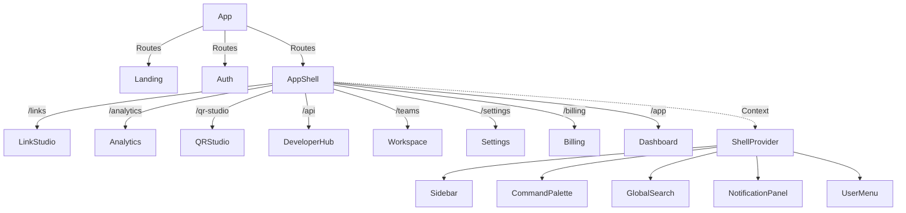
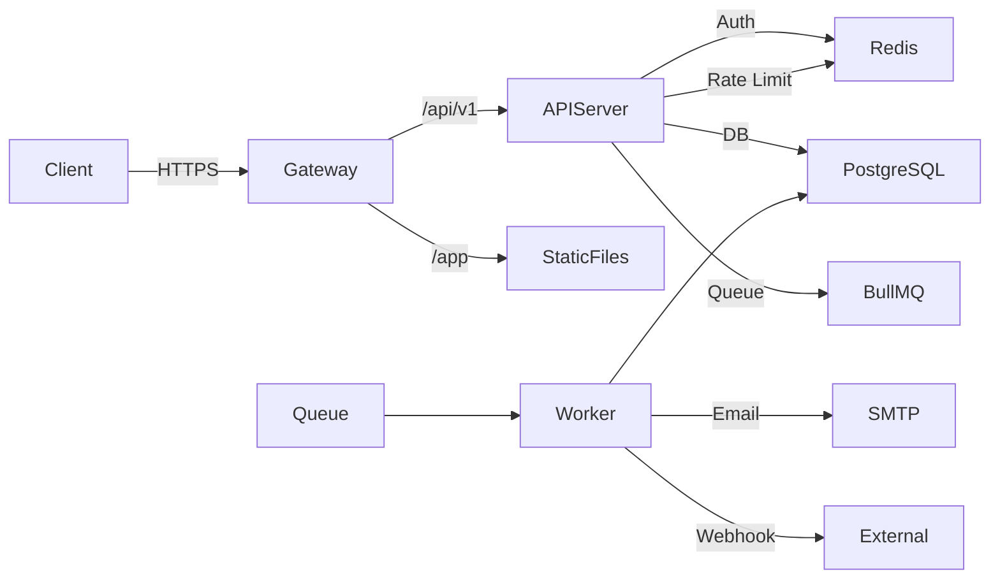
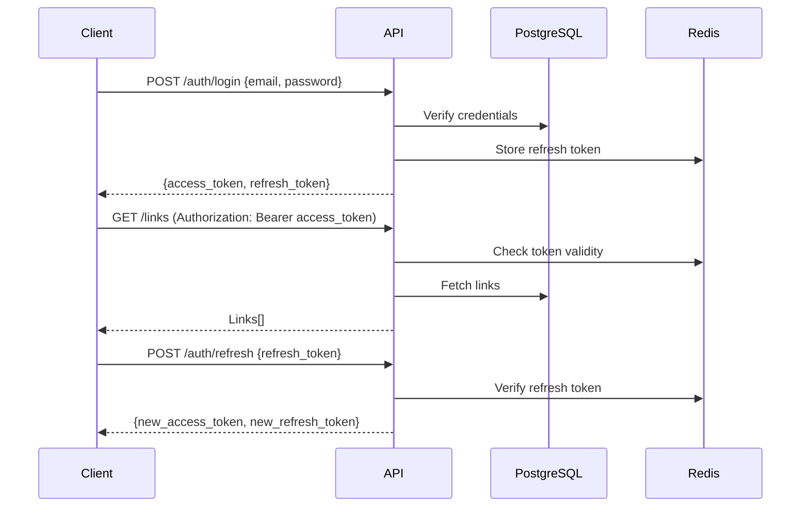

# Architecture — Nexus Links

## Monorepo Structure

```
nexus-links/
├── apps/
│   ├── api/                # Fastify backend server
│   └── web/                # React + Vite frontend
├── packages/
│   ├── ui/                 # Shared component library
│   ├── config/             # Shared TypeScript/configs
│   └── shared/             # Shared types and utilities
├── docker/                 # Docker Compose files
├── docs/                   # Documentation
├── scripts/                # Build and dev scripts
└── turbo.json              # Turborepo configuration
```

## Package Responsibilities

| Package           | Tech                           | Purpose                                          |
| ----------------- | ------------------------------ | ------------------------------------------------ |
| `apps/api`        | Fastify, Prisma, Redis         | REST API, auth, background jobs                  |
| `apps/web`        | React, Vite, Tailwind          | SPA frontend (prototype only — no backend calls) |
| `packages/ui`     | React, Tailwind, Framer Motion | Design system components, animation presets      |
| `packages/config` | TypeScript, ESLint             | Shared tooling configurations                    |
| `packages/shared` | TypeScript                     | Shared types, validation schemas, constants      |

## Frontend Architecture



### Key Patterns

- **Shell context** manages global UI state (sidebar, command palette, notifications)
- **PageLayout** wraps every authenticated page with consistent padding and page transition animation
- **PageHeader** provides title/description/actions pattern for every page
- **Mock data** is centralized in `apps/web/src/mock/data.ts` for the prototype phase

### Directory Conventions (Frontend)

```
apps/web/src/
├── auth/           # Auth pages and components
├── analytics/      # Analytics page
├── billing/        # Billing page
├── developer-hub/  # Developer Hub page
├── link-studio/    # Link Studio page
├── mock/           # Mock data
├── pages/          # Landing page
├── qr-studio/      # QR Studio page
├── settings/       # Settings page
├── shell/          # App shell, context, components
│   ├── components/ # Shell components
│   ├── pages/      # Dashboard, NotFound
│   └── states/     # EmptyState, ErrorState, Skeleton
└── workspace/      # Workspace page
```

## Backend Architecture



### API Server Structure

```
apps/api/src/
├── routes/          # Route handlers (Fastify plugins)
├── services/        # Business logic
├── repositories/    # Data access layer (Prisma)
├── middleware/      # Auth, rate limit, validation
├── webhooks/        # Webhook delivery system
├── jobs/            # Background job definitions
├── lib/             # Utilities, constants
├── config/          # Environment, feature flags
└── plugins/         # Fastify plugins
```

## Authentication Architecture



- Access tokens: 15-minute expiry, signed with RS256
- Refresh tokens: 7-day expiry, stored in Redis (allow revocation)
- Rate limiting: per-IP and per-user tiers
- Session management: view and revoke from Settings

## Data Flow

```
User Action → React Component → (Mock Data / API Call)
                                       ↓
                                  Service Layer
                                       ↓
                                Repository Layer
                                       ↓
                                  PostgreSQL
                                       ↓
                              Response → Client
```

For the prototype phase, all data flows through mock data. The real architecture will replace mock imports with API calls through a service layer.

## Caching Strategy

| Layer   | Technology                     | Cache Key | TTL   | Purpose              |
| ------- | ------------------------------ | --------- | ----- | -------------------- |
| Browser | CDN/Service Worker             | URL       | 1h    | Static assets        |
| Redis   | `link:{alias}`                 | Alias     | 5min  | Redirect resolution  |
| Redis   | `user:{id}:session`            | User ID   | 15min | Session cache        |
| Redis   | `analytics:{link_id}:{period}` | Link ID   | 1h    | Aggregated analytics |
| API     | In-memory LRU                  | Varies    | 30s   | Hot endpoint cache   |

## Background Jobs

| Job                   | Queue       | Frequency   | Trigger        |
| --------------------- | ----------- | ----------- | -------------- |
| Click ingestion       | `clicks`    | Real-time   | Batch every 5s |
| Webhook delivery      | `webhooks`  | Real-time   | Per click      |
| Email notifications   | `emails`    | As needed   | Various events |
| Analytics aggregation | `analytics` | Every 15min | Cron           |
| Link expiry check     | `expiry`    | Every hour  | Cron           |
| Cleanup deleted links | `cleanup`   | Daily       | Cron           |

## Future Scalability

- **Read replicas** for analytics queries
- **Horizontal scaling** of API servers behind load balancer
- **Sharded Redis** for session and cache data
- **CDN-based redirect** for link resolution at edge
- **Multi-region active-active** with PostgreSQL logical replication
- **GraphQL federation** for complex dashboard queries
