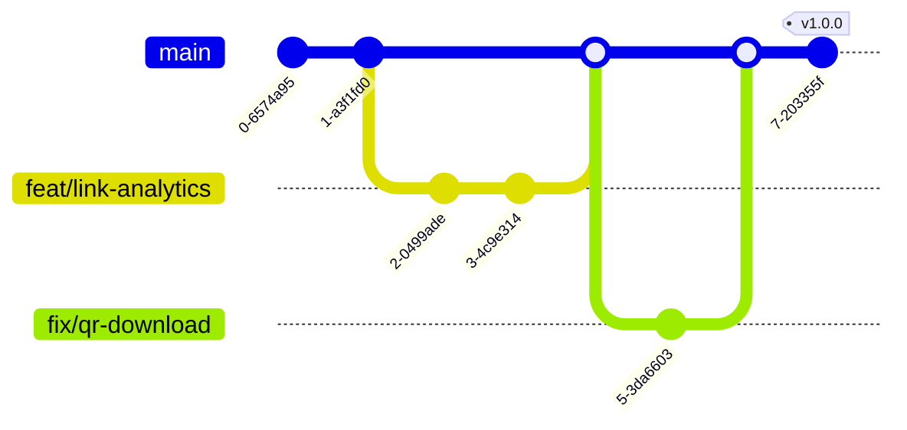

# Contributing — Nexus Links

> Standards for all code contributions.

## Git Workflow

**Trunk-based development with short-lived feature branches.**



### Branch Naming

| Pattern                        | Example                    |
| ------------------------------ | -------------------------- |
| `feat/<short-description>`     | `feat/link-analytics`      |
| `fix/<short-description>`      | `fix/qr-download-encoding` |
| `chore/<short-description>`    | `chore/update-deps`        |
| `docs/<short-description>`     | `docs/api-spec-v2`         |
| `refactor/<short-description>` | `refactor/auth-middleware` |

Use kebab-case. Keep descriptions under 50 characters.

## Commit Conventions

Follow [Conventional Commits](https://www.conventionalcommits.org/):

```
<type>(<scope>): <description>

[optional body]

[optional footer]
```

### Types

| Type       | Usage                               |
| ---------- | ----------------------------------- |
| `feat`     | New feature                         |
| `fix`      | Bug fix                             |
| `chore`    | Maintenance, deps, tooling          |
| `docs`     | Documentation only                  |
| `refactor` | Code change with no behavior change |
| `test`     | Adding or fixing tests              |
| `perf`     | Performance improvement             |
| `style`    | Formatting, linting (not CSS)       |

### Scopes

| Scope    | Package           |
| -------- | ----------------- |
| `api`    | `apps/api`        |
| `web`    | `apps/web`        |
| `ui`     | `packages/ui`     |
| `config` | `packages/config` |
| `shared` | `packages/shared` |
| `docs`   | Documentation     |
| `deps`   | Dependencies      |
| `ci`     | CI/CD             |

### Examples

```
feat(api): add link creation endpoint
fix(web): correct QR code download filename
docs(api): document rate limiting headers
chore(deps): update framer-motion to v11
refactor(ui): extract Button variants to cva
```

## Pull Requests

### Title

Same format as commit messages: `type(scope): description`

### Description Template

```markdown
## What does this PR do?

Brief description of the change.

## Related issues

Closes #123

## Screenshots

[Before/After images for UI changes]

## Testing

- [ ] Unit tests pass
- [ ] Integration tests pass
- [ ] E2E tests pass (if applicable)
- [ ] Manually tested in browser

## Checklist

- [ ] Code follows project style
- [ ] No new lint warnings
- [ ] No new TypeScript errors
- [ ] Tests added for new functionality
- [ ] Documentation updated (if applicable)
- [ ] Accessibility considered
```

### Review Process

1. Author opens PR with description
2. CI runs lint + typecheck + test + build
3. At least one approval required
4. Author merges (squash merge recommended)
5. Branch deleted after merge

## Code Review Checklist

### Every PR

- [ ] Does the code do what the PR description says?
- [ ] Are there tests for the new functionality?
- [ ] Are error states handled?
- [ ] Are loading states handled?
- [ ] Are empty states handled?
- [ ] Is the code reasonably performant?
- [ ] Are there any security concerns?
- [ ] Is the accessibility acceptable?
- [ ] No unnecessary dependencies added
- [ ] No commented-out code
- [ ] No `console.log` or debug artifacts

### Additional for UI PRs

- [ ] Responsive at all breakpoints
- [ ] Keyboard navigable
- [ ] Color contrast sufficient
- [ ] Framer Motion animations respect reduced motion
- [ ] Component follows existing patterns in the codebase

### Additional for API PRs

- [ ] Input validation (Zod)
- [ ] Authentication check
- [ ] Authorization check (RBAC)
- [ ] Rate limiting considered
- [ ] Error responses follow API spec format
- [ ] OpenAPI spec updated

## Definition of Done

A feature is done when:

1. Code is implemented and pushed
2. All tests pass (lint, typecheck, unit, integration, E2E)
3. PR approved by at least one team member
4. Merged to main
5. Deployed to production (or staging for larger features)
6. Feature flag removed (if applicable)
7. Documentation published (if user-facing)

## Coding Standards

### TypeScript

- Strict mode enabled
- `noUncheckedIndexedAccess` enforced
- Prefer interfaces over types for public APIs
- Prefer types for unions, intersections, and utility types
- No `any` — use `unknown` and type guards
- No implicit `any` — always annotate function parameters

### React

- Functional components with hooks (no class components)
- Props interfaces defined with `interface` (not inline types for public components)
- Default exports for pages, named exports for components
- Custom hooks prefixed with `use`
- Event handlers prefixed with `handle`

### CSS/Tailwind

- Utility classes for layout and spacing
- CSS custom properties for colors and design tokens
- `cn()` utility for conditional class merging (from `@nexuslinks/ui`)
- No hardcoded color values — always use theme variables
- Responsive patterns: mobile-first

### Naming Conventions

| Entity             | Convention              | Example              |
| ------------------ | ----------------------- | -------------------- |
| Components         | PascalCase              | `Button`, `LinkCard` |
| Files (components) | PascalCase              | `Button.tsx`         |
| Files (utilities)  | camelCase               | `formatDate.ts`      |
| Directories        | kebab-case              | `link-studio/`       |
| Hooks              | camelCase, `use` prefix | `useAuth`            |
| Constants          | UPPER_SNAKE_CASE        | `MAX_LINKS`          |
| Types/Interfaces   | PascalCase              | `LinkProps`          |
| CSS classes        | kebab-case              | `btn-primary`        |

## Folder Conventions

```
apps/web/src/
  <feature-name>/       # Feature directory (kebab-case)
    components/          # Feature-specific components
    hooks/               # Feature-specific hooks
    utils/               # Feature-specific utilities
    <Feature>Page.tsx    # Page component (default export)

packages/ui/src/
  components/            # All shared components (flat)
  lib/                   # Utilities, hooks, animation presets
  index.ts              # Barrel export
```

## Getting Started

```bash
# Clone
git clone https://github.com/nexuslinks/nexus-links.git

# Install
cd nexus-links
pnpm install

# Copy environment
cp apps/api/.env.example apps/api/.env

# Start development
pnpm dev
```
