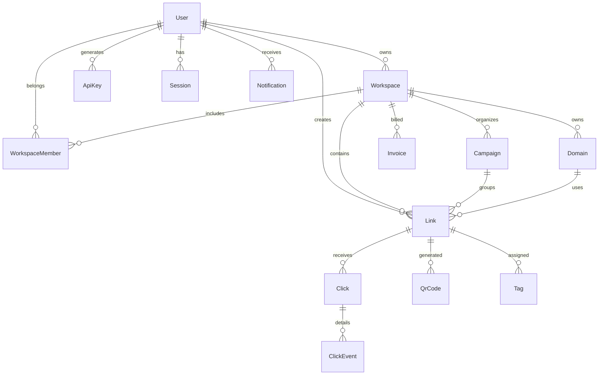

# Database Schema — Nexus Links

> Prisma ORM schema design. All models live in `apps/api/prisma/schema.prisma`.

## Entity-Relationship Diagram



## Models

### User

```prisma
model User {
  id             String   @id @default(cuid())
  email          String   @unique
  passwordHash   String
  name           String
  avatarUrl      String?
  role           UserRole @default(MEMBER)
  twoFactorKey   String?
  twoFactorEnabled Boolean @default(false)
  emailVerified  DateTime?
  createdAt      DateTime @default(now())
  updatedAt      DateTime @updatedAt
  deletedAt      DateTime?

  links          Link[]
  workspace      Workspace?
  workspaceMembers WorkspaceMember[]
  apiKeys        ApiKey[]
  sessions       Session[]
  notifications  Notification[]

  @@map("users")
}
```

### Workspace

```prisma
model Workspace {
  id        String   @id @default(cuid())
  name      String
  slug      String   @unique
  plan      PlanType @default(FREE)
  createdAt DateTime @default(now())
  updatedAt DateTime @updatedAt

  ownerId String
  owner   User   @relation(fields: [ownerId], references: [id])

  members  WorkspaceMember[]
  links    Link[]
  domains  Domain[]
  campaigns Campaign[]
  invoices Invoice[]

  @@map("workspaces")
}
```

### Link

```prisma
model Link {
  id           String   @id @default(cuid())
  alias        String
  destination  String
  title        String?
  description  String?
  password     String?
  expiresAt    DateTime?
  isDraft      Boolean  @default(false)
  isArchived   Boolean  @default(false)
  utmSource    String?
  utmMedium    String?
  utmCampaign  String?
  utmTerm      String?
  utmContent   String?
  createdAt    DateTime @default(now())
  updatedAt    DateTime @updatedAt
  deletedAt    DateTime?

  workspaceId String
  workspace   Workspace @relation(fields: [workspaceId], references: [id])

  createdById String
  createdBy   User      @relation(fields: [createdById], references: [id])

  domainId    String?
  domain      Domain?   @relation(fields: [domainId], references: [id])
  campaignId  String?
  campaign    Campaign? @relation(fields: [campaignId], references: [id])
  folderId    String?
  folder      Folder?   @relation(fields: [folderId], references: [id])

  clicks  Click[]
  qrCodes QrCode[]
  tags    LinkTag[]

  @@unique([workspaceId, alias])
  @@map("links")
}
```

### Click

```prisma
model Click {
  id        String   @id @default(cuid())
  timestamp DateTime @default(now())
  ip        String?
  userAgent String?
  referer   String?
  country   String?
  city      String?
  device    String?
  browser   String?
  os        String?
  language  String?

  linkId String
  link   Link   @relation(fields: [linkId], references: [id])

  @@index([linkId, timestamp])
  @@index([timestamp])
  @@map("clicks")
}
```

### Domain

```prisma
model Domain {
  id        String   @id @default(cuid())
  domain    String   @unique
  verified  Boolean  @default(false)
  dnsRecord String?  // TXT verification value
  sslStatus SslStatus @default(PENDING)
  createdAt DateTime @default(now())

  workspaceId String
  workspace   Workspace @relation(fields: [workspaceId], references: [id])

  links Link[]

  @@map("domains")
}
```

### ApiKey

```prisma
model ApiKey {
  id          String   @id @default(cuid())
  name        String
  keyPrefix   String   // First 8 chars for identification
  keyHash     String   @unique // bcrypt hash of full key
  permissions PermissionLevel @default(FULL)
  lastUsedAt  DateTime?
  expiresAt   DateTime?
  createdAt   DateTime @default(now())
  deletedAt   DateTime?

  userId String
  user   User   @relation(fields: [userId], references: [id])

  @@map("api_keys")
}
```

### Webhook

```prisma
model Webhook {
  id         String   @id @default(cuid())
  url        String
  events     String[] // Array of event types
  secret     String   // HMAC signing secret
  isActive   Boolean  @default(true)
  lastStatus WebhookStatus?
  lastTriggeredAt DateTime?
  createdAt  DateTime @default(now())

  workspaceId String
  workspace   Workspace @relation(fields: [workspaceId], references: [id])

  @@map("webhooks")
}
```

### Other Models

`WorkspaceMember`, `Campaign`, `Folder`, `Tag`, `LinkTag`, `QrCode`, `Session`, `Notification`, `Invoice`, `PaymentMethod`, `AuditLog` — see schema for full definitions.

## Indexes

| Table      | Index                   | Type      | Purpose                        |
| ---------- | ----------------------- | --------- | ------------------------------ |
| `links`    | `(workspace_id, alias)` | Unique    | Alias uniqueness per workspace |
| `links`    | `(alias)`               | B-tree    | Fast redirect lookup           |
| `clicks`   | `(link_id, timestamp)`  | Composite | Analytics queries              |
| `clicks`   | `(timestamp)`           | B-tree    | Time-series aggregation        |
| `api_keys` | `(key_hash)`            | Unique    | Auth lookup                    |
| `sessions` | `(user_id)`             | B-tree    | User session listing           |

## Constraints

- Links must have a unique `alias` within a workspace (composite unique)
- Domains are unique globally
- Email addresses are unique per user
- API key hashes are unique (never store raw keys)
- Foreign keys cascade on soft delete, not hard delete

## Migration Strategy

- **Prisma Migrate** for schema changes
- **Migration naming:** `YYYYMMDD_HHMMSS_description`
- **Review process:** every migration must be reviewed for data loss risk
- **Zero-downtime:** use Prisma's `createIfNotExists` and careful column additions
- **Backfill:** large table migrations run as background jobs with status tracking
- **Rollback:** each migration includes a `down.sql` for manual rollback if needed

## Soft Delete Policy

- `deletedAt` timestamp column on all user-data models
- Queries filter `WHERE deleted_at IS NULL` via Prisma middleware
- Hard delete after 30 days (cron job)
- Audit logs are never deleted (retained indefinitely)

## Audit Logging

```prisma
model AuditLog {
  id         String   @id @default(cuid())
  actorId    String?
  action     String   // link.created, workspace.updated, etc.
  resource   String   // link, workspace, user
  resourceId String?
  metadata   Json?
  ipAddress  String?
  timestamp  DateTime @default(now())

  @@index([actorId, timestamp])
  @@index([resource, resourceId])
  @@map("audit_logs")
}
```

## Performance Considerations

- Click table is the largest — partition by month (`click_2026_07`)
- Link table indexed on alias for sub-ms redirect lookups
- Analytics queries use materialized views refreshed every 15 minutes
- Full-text search on link titles and destinations via PostgreSQL tsvector
- Connection pooling via PgBouncer (transaction mode)
- Read replicas for analytics dashboard queries
- Archive clicks older than 12 months to cold storage (Parquet on S3)
