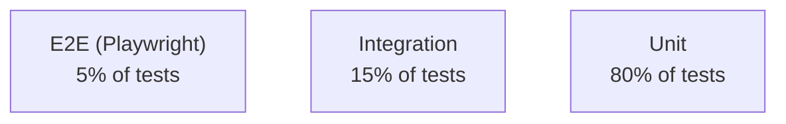

# Testing — Nexus Links

> Testing strategy, standards, and targets.

## Testing Philosophy

> "Test behavior, not implementation. Confidence over coverage."

Every pull request must maintain or improve test coverage. Tests should give the team confidence to deploy at any time.

## Testing Pyramid



## Unit Tests (Vitest)

### What to Test

- Pure utility functions
- Validation schemas (Zod)
- Repository layer queries
- Service layer business logic
- Component rendering with known props

### What NOT to Test

- Framework internals (React, Prisma, Fastify)
- Third-party library behavior
- TypeScript types (covered by `tsc --noEmit`)
- Mock data structure

### Naming Convention

```
src/services/links.test.ts
src/components/Button.test.tsx
```

### Example

```typescript
// src/services/links.test.ts
import { describe, it, expect } from 'vitest'
import { generateAlias } from './links'

describe('generateAlias', () => {
  it('generates a 6-character alias by default', () => {
    const alias = generateAlias()
    expect(alias).toHaveLength(6)
    expect(alias).toMatch(/^[a-z0-9]+$/)
  })

  it('respects custom length', () => {
    const alias = generateAlias(10)
    expect(alias).toHaveLength(10)
  })

  it('generates unique values on successive calls', () => {
    const aliases = Array.from({ length: 100 }, () => generateAlias())
    const unique = new Set(aliases)
    expect(unique.size).toBe(100)
  })
})
```

## Integration Tests (Vitest + Supertest)

### What to Test

- API endpoint happy paths
- API error paths (validation, auth, not-found)
- Authentication flow (register → login → refresh)
- RBAC enforcement (admin vs viewer access)
- Rate limiting enforcement

### Setup

```typescript
// tests/setup.ts
import { buildApp } from '../src/app'
import { prisma } from '../src/lib/prisma'

export async function createTestApp() {
  const app = buildApp({
    logger: false,
  })

  beforeAll(async () => {
    await app.ready()
  })

  afterAll(async () => {
    await app.close()
    await prisma.$disconnect()
  })

  return app
}
```

### Example

```typescript
// tests/integration/links.test.ts
import { describe, it, expect } from 'vitest'
import { createTestApp, getAuthToken } from '../setup'

describe('POST /v1/links', () => {
  it('creates a link for authenticated users', async () => {
    const app = await createTestApp()
    const token = await getAuthToken(app)

    const response = await app.inject({
      method: 'POST',
      url: '/v1/links',
      headers: { Authorization: `Bearer ${token}` },
      payload: {
        destination: 'https://example.com',
        alias: 'test-link',
      },
    })

    expect(response.statusCode).toBe(201)
    const body = response.json()
    expect(body.data.alias).toBe('test-link')
  })

  it('rejects unauthenticated requests', async () => {
    const app = await createTestApp()

    const response = await app.inject({
      method: 'POST',
      url: '/v1/links',
      payload: { destination: 'https://example.com' },
    })

    expect(response.statusCode).toBe(401)
  })
})
```

## End-to-End Tests (Playwright)

### What to Test

- Critical user journeys (create link → share → see analytics)
- Auth flows (login, register, password reset)
- Billing flow (upgrade plan, see invoice)
- Navigation (sidebar, command palette, search)

### Test Structure

```
e2e/
├── fixtures/       # Test data factory
├── pages/          # Page object models
├── specs/          # Test files
│   ├── auth.spec.ts
│   ├── links.spec.ts
│   └── billing.spec.ts
└── utils/          # Helpers
```

### Example

```typescript
// e2e/specs/links.spec.ts
import { test, expect } from '@playwright/test'

test('user creates and shares a link', async ({ page }) => {
  await page.goto('/login')
  await page.fill('[name=email]', 'test@example.com')
  await page.fill('[name=password]', 'password123')
  await page.click('button[type=submit]')

  await page.waitForURL('/app')
  await page.click('text=Create Link')

  await page.fill('[name=destination]', 'https://example.com')
  await page.fill('[name=alias]', 'my-test')
  await page.click('text=Publish')

  await expect(page.locator('text=nexus.links/my-test')).toBeVisible()
  await expect(page.locator('text=Copy')).toBeVisible()
})
```

## Visual Regression Tests (Chromatic/Storybook)

- Every component in `packages/ui` has a Storybook story
- Visual changes reviewed in Chromatic before merge
- Baseline updated on main branch only
- Threshold: 0.1% pixel diff triggers review

## Performance Tests (k6)

### Scenarios

| Scenario        | VUs            | Duration | Expectations            |
| --------------- | -------------- | -------- | ----------------------- |
| Link redirect   | 200 concurrent | 5 min    | P95 < 50ms, 0% errors   |
| Create link API | 50 concurrent  | 5 min    | P95 < 200ms, <1% errors |
| Analytics query | 30 concurrent  | 5 min    | P95 < 500ms             |
| Login flow      | 20 concurrent  | 3 min    | P95 < 1s                |

### Thresholds

```javascript
export const options = {
  thresholds: {
    http_req_duration: ['p(95)<200'],
    http_req_failed: ['rate<0.01'],
  },
  stages: [
    { duration: '30s', target: 20 },
    { duration: '1m', target: 50 },
    { duration: '30s', target: 100 },
    { duration: '1m', target: 100 },
    { duration: '30s', target: 0 },
  ],
}
```

## Accessibility Tests (axe)

- Run in CI via `@axe-core/playwright`
- WCAG AA standard (Level AAA where practical)
- Every page tested: landing, auth, all app pages
- Violations fail the build; best-practices are warnings
- Manual audit quarterly with screen reader (NVDA, VoiceOver)

## Security Tests

- **SAST:** ESLint security plugin + CodeQL in CI
- **DAST:** OWASP ZAP baseline scan on staging
- **Dependency scanning:** Snyk weekly, Dependabot daily
- **Secret scanning:** `trufflehog` in CI
- **Manual:** Annual penetration test by third-party

## Coverage Targets

| Layer                | Target                | Gate            |
| -------------------- | --------------------- | --------------- |
| Unit (services)      | 90%                   | PR fail < 80%   |
| Unit (components)    | 80%                   | PR fail < 70%   |
| Integration (API)    | 80%                   | PR fail < 70%   |
| E2E (critical paths) | 100% of defined paths | Build fail      |
| Visual (components)  | 100%                  | Review required |

Coverage is a signal, not a target. If a critical piece of logic needs 100% coverage, it gets it. If a trivial wrapper doesn't need a test, that's fine — document the reasoning.

## Test Commands

```bash
pnpm test             # Run all tests
pnpm test:unit        # Unit only
pnpm test:int         # Integration only
pnpm test:e2e         # E2E (requires running app)
pnpm test:coverage    # Coverage report
pnpm test:watch       # Watch mode
```
